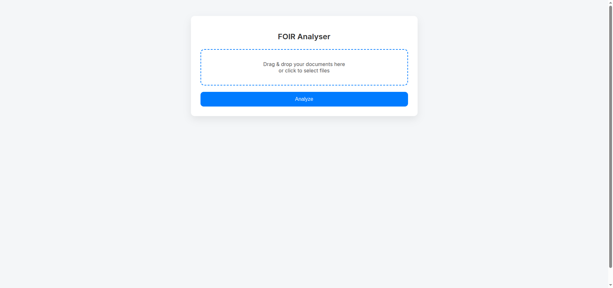
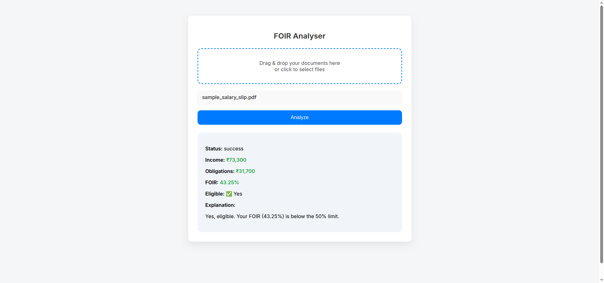
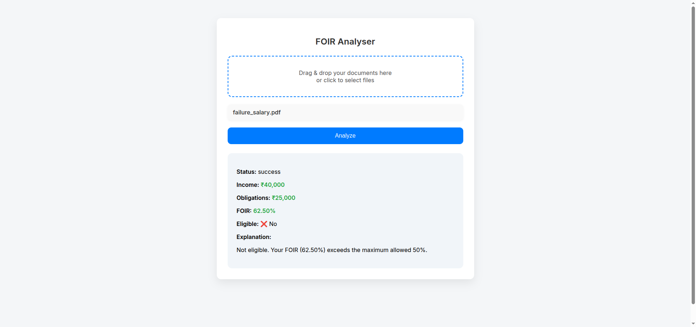

# FOIR Analyser

FOIR Analyser is a tool designed to analyze FOIR (Fixed Obligation to Income Ratio) data. It provides a simple interface for processing and reviewing FOIR-related information.

## Features
- Analyze FOIR data from logs or input files
- Simple web interface (via `index.php`)
- Logging of analysis results (`foir.log`)
- Python backend (`app.py`)

## Getting Started

### Prerequisites
- Python 3.8+
- PHP (for web interface)

### Installation
1. Clone the repository:
   ```bash
   git clone <repo-url>
   cd FOIR Analyser
   ```
2. Install Python dependencies:
   ```bash
   pip install -r requirements.txt
   ```
3. Configure environment variables in `.env` as needed.

### Usage
- Run the Python backend:
  ```bash
  python app.py
  ```
- Access the web interface via `index.php` in your browser.

## File Structure
- `app.py`: Main Python application for FOIR analysis
- `index.php`: Web interface
- `foir.log`: Log file for analysis results
- `.env`: Environment configuration

## License
MIT License

## Workflow
If you want to see how the project works, here are some walkthrough images:
 

 
Upload Salary slip, credit card bill....(pdf,png)

 
After Processing you will get output.

Success Case
 


 Faiure Case

